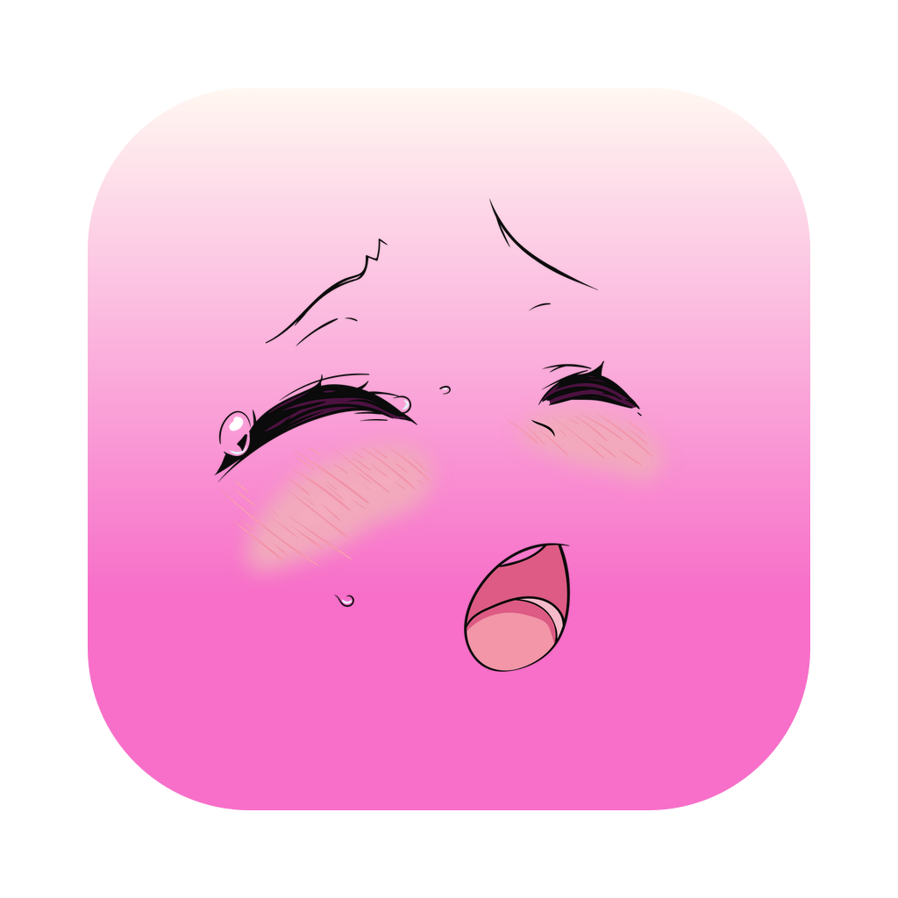

# GoonLib

**A local-first media library for images and video.**

Point it at the folders you already have. It reads them where they sit, works out
what is in them, and leaves them alone — nothing is copied, renamed or moved unless
you ask, and nothing ever leaves the machine.

## Download

Downloads are on the [releases page](../../releases) with:
- `.dmg` for macOS on Apple Silicon or Intel
- `.exe` for Windows
- `.appimage` for Linux

⚠️ Apps are all unsigned, so the first launch needs a click past the warning that generates.
- on macOS: right-click the app and choose Open
- on Windows: More info -> then Run anyway. 
- on Linux: you're probably fine

## Building & contributing

Running it from source, how the project is laid out, and how to send a change:
see [CONTRIBUTING.md](CONTRIBUTING.md).

## Features
A brief overview of features per category

### App
GoonLib comes with a few base features such as:
- **Appearance**: App comes with full custom export/importable theming support
- **Shortcuts**: For common controls and actions, with rebinds for all available for all shortcuts.
- **Feature toggles**: Don't like it? Then disable it!
- **Backup**: Because re-applying application settings and themes is annoying (does not touch your library)

### Multi-media library
An interactive library manager with:
- **Multi-source support**: Library searches all available and enabled sources
- **Favourites**: For your preferred material
- **Tags**: for organising your media files
- **Collections**: for bringing together your tags and media
- **Meta data**: for both the image properties and EXIF data
- **Formats**: all common image, video and web-formats.
- **Thumbnails & Previews**: generated using local (non-ai) libraries
- **Duplicate detection**: using content hashing to allow easy cleanup
- **Watch history**: with video positions to allow you to pause & resume your gooning sessions.
- **Search**: any bit of info from your library from names to tags/collections ++
- **Filters & Sort-by**: for easy organisation  
- **Shuffle**: your content or the next media item for a fresh experience.
- **Storage Analyser**: see a breakdown of your goonlib based on sources, folders, tags, types and more.
- **Media auto-play & resume**: to make your watching experience smoother
- **Bulk operations**: finetuned to allow efficient library management

### Watch Together
Let's you share a session based web-version of goonlib, so that you can goon together with friends & partners alike.

This is done via a fancy little tunnel over something called a...
- Reverse proxy, like [cloudflared](https://github.com/cloudflare/cloudflared) or [ngrok](https://ngrok.com/)
- It can also be done over local network! (*but then Router FW/NAT rules may apply)

To start a session, click the "Watch Together" button in the sidebar and...
1. Select your sharing method (cloudflared recommended)
2. Start your session & share your link
3. Verify & let in your guest

⚠️ Privacy and/or safety notes:
- All sessions are protected by a unique code word
- All guests must be let in individually
- All enabled sources are browseable by guests
- Host has "the controller" for the media player as default
  - Guests can request it (or add items to the watch queue)
- Host can always override toy controls for connected toys
- Sessions do not persist

### Toy Integrations
For both Lovense *(full, incl. multi-engine 'stroker+vibrator' support)* and generic bluetooth devices. This includes (so far):
- **Pre-defined toy control patterns**: (steady, pulse, wave, build, burst)
- **Custom pattern creator**: so you can create your own perfect vibes
  - **Funscript Support**: so you can re-use your patterns elsewhere.
- **Video Sync**: Sync your yours to the 'beat' of a video via...
  - **Video Pattern generator**: generate unique patterns based of the video's audio/sound profile
- **Shareable control**: Allows you to (at-will) share control of your toy with guests in watch-together sessions

### AI Content categorization
- Based on BYOM (Bring-Your-Own-Model)
  - Support for Claude and/or OpenAI compatible cloud models.
  - Support for local hosted models over Olama, LMStudio, vLLM (etc)
    - Example model: `qwen3-vl-8b-nsfw-caption-v4.5`
- **Content Classifier**: using three sub-features, each toggleable:
  1. **Auto-tagger**: for all content types based of thumbnails/previews
  2. **Description generator**: writes alt-text descriptions based of thumbnails/previews
  3. **Collection Sorter**: auto-sorts content into collections based on tags & descriptions.

ℹ️ AI Notice(s):
- All AI features are opt-in
- All AI features are local-first
- All AI Tags & Collections are marked and filterable
- No AI features are required.

---

## Licence

Apache 2.0 — see [LICENSE](LICENSE). Use it, change it, ship it, sell it. Keep the
licence and the [NOTICE](NOTICE) with it, and say which files you changed.

If you build something on this, a credit is appreciated beyond what the licence asks
for — but it is a request, not a condition.
